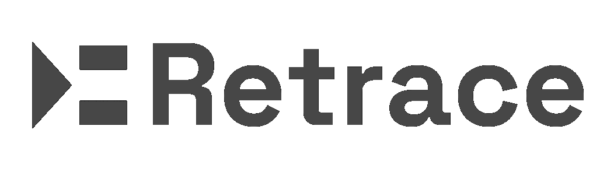

<div align="center">




**The official Homebrew tap for the Retrace CLI.**

Record, replay, fork, and manage AI agent traces from your terminal — installable on macOS, Linux, and WSL.

[Retrace](https://retraceai.tech) · [CLI site](https://cli.retraceai.tech) · [Documentation](https://docs.retraceai.tech)

</div>

---

## Install

Add the tap once, then install with the short name:

```bash
brew tap retraceai-tech/homebrew-tap
brew trust retraceai-tech/tap
brew install retrace-cli
```

The CLI installs as the `retrace` command.

```bash
brew upgrade retrace-cli      # update
brew uninstall retrace-cli    # remove
```

> Prefer a single command (no tap/trust step)? `brew install --cask retraceai-tech/tap/retrace-cli` also works — the fully-qualified form taps and trusts automatically on Homebrew 6.0+. The cask token is `retrace-cli` (the command is still `retrace`) to avoid a collision with an unrelated `retrace` app in homebrew-cask.

## How it works

The cask in [`Casks/retrace-cli.rb`](Casks/retrace-cli.rb) downloads the prebuilt binary for your platform from the Retrace CDN (`cdn.retraceai.tech`) — the same artifacts used by the `curl -fsSL https://retraceai.tech/install.sh | sh` installer and `retrace update`.

It is **auto-generated** by the Retrace CLI release pipeline on every new version (do not edit it by hand).

## Other install methods

```bash
# Install script (macOS, Linux, Windows)
curl -fsSL https://retraceai.tech/install.sh | sh
```

See the [CLI documentation](https://cli.retraceai.tech/docs/installation) for direct binary downloads and all options.

## License

MIT — part of [Retrace](https://retraceai.tech), the execution replay engine for AI agents.
